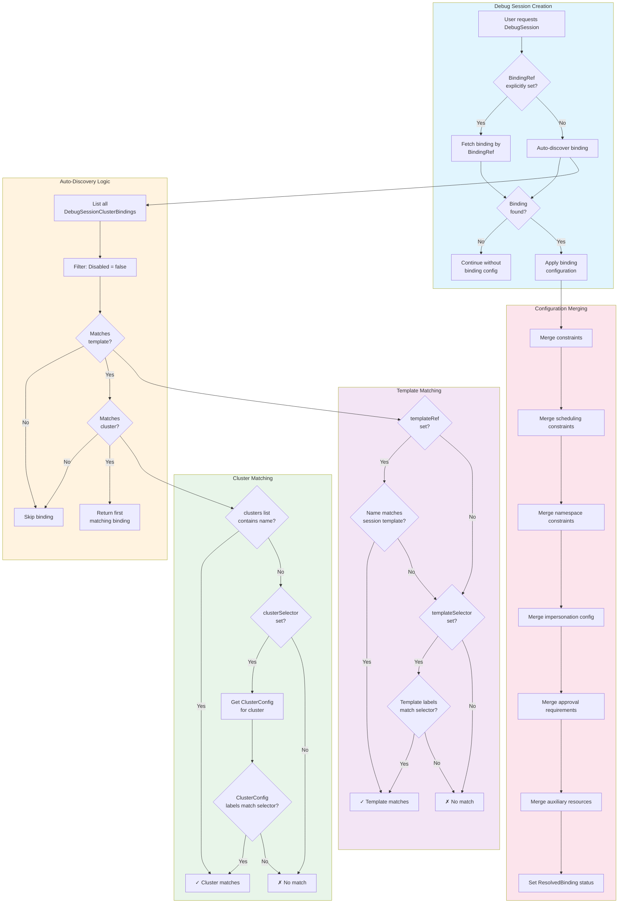

# Debug Session Cluster Bindings

`DebugSessionClusterBinding` resources delegate access to debug session templates for specific clusters and teams. They enable administrators to:

- **Scope template access** to specific clusters
- **Delegate to teams** with different permissions per cluster
- **Override constraints** such as durations, namespaces, and approval requirements
- **Configure impersonation** for least-privilege deployment

**Type Definition:** [`DebugSessionClusterBinding`](../api/v1alpha1/debug_session_cluster_binding_types.go)

## Overview

While `DebugSessionTemplate` defines what a debug session does, `DebugSessionClusterBinding` controls who can use it and where:

```
┌──────────────────────────┐       ┌──────────────────────────────┐
│  DebugSessionTemplate    │◄──────│  DebugSessionClusterBinding  │
│  (What to deploy)        │       │  (Who, Where, With overrides)│
└──────────────────────────┘       └──────────────────────────────┘
         │                                      │
         │                                      │
         ▼                                      ▼
┌──────────────────────────┐       ┌──────────────────────────────┐
│  Debug Pod deployed      │       │  Team-A on Cluster-X         │
│  with template config    │       │  with custom constraints     │
└──────────────────────────┘       └──────────────────────────────┘
```

## Basic Configuration

### Minimal Binding

```yaml
apiVersion: breakglass.t-caas.telekom.com/v1alpha1
kind: DebugSessionClusterBinding
metadata:
  name: sre-production-access
  namespace: breakglass
spec:
  templateRef:
    name: network-debug
  clusters:
    - production-eu
  allowed:
    groups:
      - sre-team
```

### Full Example

```yaml
apiVersion: breakglass.t-caas.telekom.com/v1alpha1
kind: DebugSessionClusterBinding
metadata:
  name: team-alpha-debug
  namespace: team-alpha
spec:
  # Reference to the template
  templateRef:
    name: standard-debug
  
  # Target clusters (exact names, no globs)
  clusters:
    - production-eu
    - production-us
  
  # Display name for UI
  displayName: "Team Alpha Production Debug"
  
  # Who can use this binding
  allowed:
    groups:
      - team-alpha-sre
      - team-alpha-oncall
  
  # Override session constraints
  constraints:
    maxDuration: "2h"
    defaultDuration: "30m"
    maxRenewals: 1
  
  # Override namespace constraints
  namespaceConstraints:
    allowedPatterns:
      - "team-alpha-*"
    deniedPatterns:
      - "kube-*"
    defaultNamespace: "team-alpha-debug"
    allowUserNamespace: true
  
  # Scheduling constraints
  schedulingConstraints:
    deniedNodeLabels:
      node-role.kubernetes.io/control-plane: ""
  
  # Custom approval workflow
  approvers:
    groups:
      - team-alpha-leads
  
  # Impersonation for least-privilege
  impersonation:
    serviceAccountRef:
      name: team-alpha-debugger
      namespace: team-alpha
  
  # Require specific auxiliary resources
  requiredAuxiliaryResourceCategories:
    - network-policy
```

## Specification Reference

### templateRef

Reference to the `DebugSessionTemplate` this binding applies to:

```yaml
templateRef:
  name: network-debug    # Required: template name
  namespace: ""          # Optional: defaults to cluster-scoped
```

### clusters

List of exact cluster names (no glob patterns):

```yaml
clusters:
  - production-eu
  - production-us
  - staging-eu
```

### allowed

Groups and users who can create sessions via this binding:

```yaml
allowed:
  groups:
    - sre-team
    - platform-oncall
  users:
    - admin@example.com
```

### constraints

Override template session constraints:

| Field | Type | Description |
|-------|------|-------------|
| `maxDuration` | string | Maximum session duration (e.g., "2h") |
| `defaultDuration` | string | Default duration if not specified |
| `allowRenewal` | bool | Whether renewals are allowed |
| `maxRenewals` | int | Maximum renewal count |

### namespaceConstraints

Override namespace restrictions:

| Field | Type | Description |
|-------|------|-------------|
| `allowedPatterns` | string[] | Allowed namespace patterns |
| `deniedPatterns` | string[] | Denied namespace patterns |
| `defaultNamespace` | string | Default namespace for sessions |
| `allowUserNamespace` | bool | Allow users to specify namespace |

### schedulingConstraints

Additional scheduling restrictions:

| Field | Type | Description |
|-------|------|-------------|
| `nodeSelector` | map | Required node labels |
| `deniedNodeLabels` | map | Labels that exclude nodes |
| `tolerations` | array | Additional tolerations |

### approvers

Override approval configuration:

```yaml
approvers:
  groups:
    - security-leads
  users:
    - security-admin@example.com
autoApprove: false  # Require manual approval
```

### impersonation

Configure ServiceAccount impersonation:

```yaml
impersonation:
  serviceAccountRef:
    name: debug-deployer
    namespace: breakglass-system
```

### requiredAuxiliaryResourceCategories

Force specific auxiliary resource categories to be enabled:

```yaml
requiredAuxiliaryResourceCategories:
  - network-policy    # Mandatory network isolation
  - rbac              # Mandatory RBAC setup
```

### auxiliaryResourceOverrides

Enable or disable specific auxiliary resource categories:

```yaml
auxiliaryResourceOverrides:
  network-policy: true    # Enable
  monitoring: false       # Disable
```

> **Note:** Categories in `requiredAuxiliaryResourceCategories` cannot be disabled.

### Time-Bounded Access

Control when the binding is active:

| Field | Type | Description |
|-------|------|-------------|
| `expiresAt` | metav1.Time | When the binding expires and becomes inactive |
| `effectiveFrom` | metav1.Time | When the binding becomes effective |

```yaml
# Temporary access during maintenance window
spec:
  effectiveFrom: "2026-02-01T00:00:00Z"
  expiresAt: "2026-02-07T23:59:59Z"
  # ... other fields
```

### Session Limits

Control the number of concurrent sessions:

| Field | Type | Description |
|-------|------|-------------|
| `maxActiveSessionsPerUser` | int32 | Maximum active sessions per user via this binding |
| `maxActiveSessionsTotal` | int32 | Maximum total active sessions via this binding |

```yaml
spec:
  maxActiveSessionsPerUser: 2  # Each user can have at most 2 active sessions
  maxActiveSessionsTotal: 10   # Total of 10 sessions across all users
```

### UI Display Options

Control how the binding appears in the UI:

| Field | Type | Description |
|-------|------|-------------|
| `displayName` | string | Human-readable name for the binding |
| `hidden` | bool | Hide this binding from UI (still usable via API/CLI) |
| `priority` | int32 | UI display ordering (lower values appear first) |
| `disabled` | bool | Disable the binding entirely |

```yaml
spec:
  displayName: "Emergency Production Access"
  priority: 10
  hidden: false
  disabled: false
```

### Session Metadata

Labels and annotations to apply to created sessions:

```yaml
spec:
  labels:
    team: platform-sre
    access-type: emergency
  annotations:
    breakglass.example.com/ticket: "required"
```

These labels and annotations are propagated to:
- The DebugSession resource
- The deployed workloads (Deployment/Job)
- The pod templates

### Request Reason Configuration

Configure reason requirements for session requests:

```yaml
spec:
  requestReason:
    mandatory: true
    description: "Please provide a ticket number and brief description"
    minLength: 20
    maxLength: 500
    suggestedReasons:
      - "Incident investigation - TICKET-"
      - "Performance debugging"
      - "Configuration verification"
```

| Field | Type | Description |
|-------|------|-------------|
| `mandatory` | bool | Whether a reason is required |
| `description` | string | Help text shown to users |
| `minLength` | int32 | Minimum character length |
| `maxLength` | int32 | Maximum character length |
| `suggestedReasons` | string[] | Pre-defined reason options |

### Approval Reason Configuration

Configure reason requirements for approvals/rejections:

```yaml
spec:
  approvalReason:
    mandatory: true
    mandatoryForRejection: true
    description: "Explain why this access is approved or rejected"
```

### Notification Configuration

Override template notification settings:

```yaml
spec:
  notification:
    enabled: true
    channels:
      - email
      - slack
    recipients:
      - security@example.com
```

## Status

The controller populates status fields:

```yaml
status:
  resolvedTemplates:
    - standard-debug
  resolvedClusters:
    - production-eu
    - production-us
  conditions:
    - type: Ready
      status: "True"
      reason: Reconciled
      message: "Binding ready"
```

## Use Cases

### Multi-Tenant Cluster Access

Delegate different levels of access per tenant:

```yaml
# Platform team - full access
apiVersion: breakglass.t-caas.telekom.com/v1alpha1
kind: DebugSessionClusterBinding
metadata:
  name: platform-full-access
spec:
  templateRef:
    name: node-debug
  clusters:
    - shared-cluster
  allowed:
    groups:
      - platform-sre
  constraints:
    maxDuration: "4h"
---
# Application team - limited access
apiVersion: breakglass.t-caas.telekom.com/v1alpha1
kind: DebugSessionClusterBinding
metadata:
  name: app-team-limited
spec:
  templateRef:
    name: app-debug
  clusters:
    - shared-cluster
  allowed:
    groups:
      - app-developers
  constraints:
    maxDuration: "1h"
  namespaceConstraints:
    allowedPatterns:
      - "app-*"
```

### Environment-Specific Constraints

Different constraints per environment:

```yaml
# Production - strict
apiVersion: breakglass.t-caas.telekom.com/v1alpha1
kind: DebugSessionClusterBinding
metadata:
  name: sre-production
spec:
  templateRef:
    name: network-debug
  clusters:
    - production-eu
  constraints:
    maxDuration: "1h"
  approvers:
    groups:
      - security-team
---
# Staging - relaxed
apiVersion: breakglass.t-caas.telekom.com/v1alpha1
kind: DebugSessionClusterBinding
metadata:
  name: sre-staging
spec:
  templateRef:
    name: network-debug
  clusters:
    - staging-eu
  constraints:
    maxDuration: "4h"
  autoApprove: true  # No approval needed
```

### Least-Privilege with Impersonation

Deploy debug resources with minimal permissions:

```yaml
apiVersion: breakglass.t-caas.telekom.com/v1alpha1
kind: DebugSessionClusterBinding
metadata:
  name: secure-debug
spec:
  templateRef:
    name: network-debug
  clusters:
    - production-eu
  impersonation:
    serviceAccountRef:
      name: debug-deployer-limited
      namespace: breakglass-system
  requiredAuxiliaryResourceCategories:
    - network-policy  # Always require network isolation
```

## API Integration

### Template Clusters Endpoint

When creating a session via the UI, the template clusters API returns per-cluster details:

```http
GET /api/debugSessions/templates/:name/clusters
```

Response includes binding information:

```json
{
  "clusters": [
    {
      "name": "production-eu",
      "bindingRef": {
        "name": "sre-production",
        "namespace": "breakglass"
      },
      "constraints": { ... },
      "approval": { ... }
    }
  ]
}
```

See [API Reference](api-reference.md#get-template-clusters) for full details.

## Best Practices

1. **Least Privilege**: Use the most restrictive constraints possible per cluster
2. **Named Bindings**: Use descriptive names like `team-environment-purpose`
3. **Audit Trail**: Bindings provide clear ownership and access records
4. **Impersonation**: Use ServiceAccount impersonation for production clusters
5. **Required Resources**: Use `requiredAuxiliaryResourceCategories` for security controls

## Troubleshooting

### Binding Not Taking Effect

1. Check binding status:
   ```bash
   kubectl get debugsessionclusterbinding -n breakglass -o yaml
   ```

2. Verify template reference exists:
   ```bash
   kubectl get debugsessiontemplate <name>
   ```

3. Check conditions in status for errors

### Display Name Collision

Bindings with the same `displayName` for the same template+cluster are rejected by the webhook to prevent UI confusion.

### Approval Configuration

If sessions are being auto-approved unexpectedly, check:
- Binding's `autoApprove` field
- Template's `autoApprove` configuration
- User's group membership in approver groups

## Binding Resolution and Config Merging

This section explains how bindings are resolved and how configuration is merged when creating debug sessions.

### Resolution Flow Diagram



### Auto-Discovery Process

When a debug session is created without an explicit `BindingRef`, the controller automatically searches for a matching binding:

1. **List all bindings** in the cluster
2. **Filter disabled bindings** (skip any with `spec.disabled: true`)
3. **Match template** using one of:
   - **templateRef**: Exact name match with the session's template
   - **templateSelector**: Label selector matching template's metadata labels
4. **Match cluster** using one of:
   - **clusters**: Exact match in the explicit cluster name list
   - **clusterSelector**: Label selector matching `ClusterConfig` labels
5. **Return first match** - the first binding satisfying both template and cluster criteria

```go
// Simplified auto-discovery logic
for _, binding := range allBindings {
    if binding.Spec.Disabled {
        continue
    }
    if !matchesTemplate(binding, template) {
        continue
    }
    if !matchesCluster(binding, clusterName, clusterConfig) {
        continue
    }
    return binding // First match wins
}
```

### Template Matching Options

Bindings can match templates using two methods. At least one must be specified:

#### 1. Explicit Template Reference (`templateRef`)

Direct reference to a specific template by name:

```yaml
spec:
  templateRef:
    name: network-debug
    # namespace: optional, defaults to cluster-scoped templates
```

**Use when:** You want to bind to exactly one template.

#### 2. Label Selector (`templateSelector`)

Match templates by their metadata labels:

```yaml
spec:
  templateSelector:
    matchLabels:
      breakglass.t-caas.telekom.com/persona: developer
      breakglass.t-caas.telekom.com/risk-level: low
```

**Use when:** You want to bind to multiple templates with common characteristics.

**Supported label selectors:**
- `matchLabels`: Key-value pairs that must all match
- `matchExpressions`: Complex expressions (In, NotIn, Exists, DoesNotExist)

```yaml
spec:
  templateSelector:
    matchLabels:
      breakglass.t-caas.telekom.com/persona: developer
    matchExpressions:
      - key: breakglass.t-caas.telekom.com/environment
        operator: In
        values:
          - development
          - staging
      - key: breakglass.t-caas.telekom.com/deprecated
        operator: DoesNotExist
```

#### Template Matching Priority

If both `templateRef` and `templateSelector` are specified:
1. `templateRef` is checked first (exact match)
2. If no match, `templateSelector` is evaluated against template labels
3. If neither matches, the binding is skipped

### Cluster Matching Options

Bindings can target clusters using three methods:

#### 1. Explicit Cluster List (`clusters`)

List of exact cluster names:

```yaml
spec:
  clusters:
    - production-eu
    - production-us
    - staging-eu
```

**Use when:** You know exactly which clusters should have access.

**Note:** Cluster names must match exactly; glob patterns are NOT supported.

#### 2. Label Selector (`clusterSelector`)

Match clusters by their `ClusterConfig` resource labels:

```yaml
spec:
  clusterSelector:
    matchLabels:
      environment: production
      region: eu
```

**Use when:** You want to target clusters dynamically by their characteristics.

**Prerequisite:** Clusters must have a `ClusterConfig` resource with appropriate labels:

```yaml
apiVersion: breakglass.t-caas.telekom.com/v1alpha1
kind: ClusterConfig
metadata:
  name: production-eu           # Must match the cluster name
  namespace: breakglass
  labels:
    environment: production
    region: eu
    breakglass.t-caas.telekom.com/cluster: production-eu
spec:
  # ... cluster configuration
```

**Label selector options:**

```yaml
spec:
  clusterSelector:
    matchLabels:
      environment: production
    matchExpressions:
      - key: region
        operator: In
        values:
          - eu
          - us
      - key: decommissioned
        operator: DoesNotExist
```

#### 3. Template's Allowed Clusters (`allowed.clusters` on template)

Templates can define which clusters they apply to using glob patterns:

```yaml
# In DebugSessionTemplate
spec:
  allowed:
    clusters:
      - "production-*"
      - "staging-*"
      - "dev-*"
```

**Note:** This is on the **template**, not the binding. Bindings can further restrict access but cannot expand beyond the template's allowed clusters.

### Matching Combinations

| Template Matching | Cluster Matching | Use Case |
|------------------|------------------|----------|
| `templateRef` | `clusters` | Specific template to specific clusters |
| `templateRef` | `clusterSelector` | Specific template to clusters by labels |
| `templateSelector` | `clusters` | Templates by label to specific clusters |
| `templateSelector` | `clusterSelector` | Templates by label to clusters by label |

**Example: Dynamic binding for all developer templates on all dev clusters**

```yaml
apiVersion: breakglass.t-caas.telekom.com/v1alpha1
kind: DebugSessionClusterBinding
metadata:
  name: dev-clusters-developer-access
spec:
  templateSelector:
    matchLabels:
      breakglass.t-caas.telekom.com/persona: developer
  clusterSelector:
    matchLabels:
      environment: development
  namespaceConstraints:
    allowUserNamespace: true
    allowedNamespaces:
      patterns: ["*"]  # Full namespace access on dev clusters
```

### Cluster Name vs ClusterConfig Matching

Understanding the difference between cluster name matching and `ClusterConfig` label matching:

| Aspect | `clusters` (name list) | `clusterSelector` (labels) |
|--------|----------------------|---------------------------|
| Matching | Exact string match | Label selector on ClusterConfig |
| Dynamic | No - must update binding | Yes - new clusters auto-match |
| Prerequisite | None | ClusterConfig must exist |
| Glob patterns | Not supported | Use label expressions |

**Important:** If `clusterSelector` is used but no `ClusterConfig` exists for a cluster, that cluster will NOT match the binding (even if it would logically fit the selector).

### Configuration Merge Rules

When a binding is found (explicit or auto-discovered), its configuration is merged with the template's configuration. The merge follows a **binding-extends-template** pattern:

| Configuration Area | Merge Behavior |
|-------------------|----------------|
| **constraints** | Field-level merge: binding fields override template fields |
| **schedulingConstraints** | Full replacement: binding takes precedence |
| **namespaceConstraints** | Field-level merge with extension: see details below |
| **schedulingOptions** | Full replacement: binding takes precedence |
| **impersonation** | Full replacement: binding takes precedence |
| **approvers** | Full replacement: binding takes precedence |
| **requiredAuxiliaryResourceCategories** | Additive: both template and binding categories required |

#### Constraints Merge (Field-Level)

```yaml
# Template constraints
spec:
  constraints:
    maxDuration: "4h"
    defaultDuration: "1h"
    maxConcurrentSessions: 5
    maxRenewals: 3

# Binding overrides
spec:
  constraints:
    maxDuration: "2h"        # Overrides template
    maxRenewals: 1           # Overrides template
    # defaultDuration: inherited from template ("1h")
    # maxConcurrentSessions: inherited from template (5)

# Effective result
constraints:
  maxDuration: "2h"          # From binding
  defaultDuration: "1h"      # From template
  maxConcurrentSessions: 5   # From template
  maxRenewals: 1             # From binding
```

#### Full Replacement Fields

For scheduling constraints, impersonation, and approvers, the binding's configuration completely replaces the template's when set:

```yaml
# Template
spec:
  schedulingConstraints:
    nodeSelector:
      node-type: debug
    deniedNodeLabels:
      node-role.kubernetes.io/control-plane: ""

# Binding (completely replaces template)
spec:
  schedulingConstraints:
    nodeSelector:
      node-type: team-a
    # Note: deniedNodeLabels is lost since binding replaces template entirely

# Effective result: binding's schedulingConstraints only
schedulingConstraints:
  nodeSelector:
    node-type: team-a
```

#### Namespace Constraints Merge (Field-Level with Extension)

Namespace constraints use **field-level merging** where the binding can **extend** template permissions. This allows bindings to grant additional access beyond what the template allows:

| Field | Merge Behavior |
|-------|----------------|
| `allowUserNamespace` | Binding `true` overrides template `false` (extension) |
| `defaultNamespace` | Binding value overrides template value |
| `allowedNamespaces.patterns` | Combined (union) from both template and binding |
| `deniedNamespaces.patterns` | Binding replaces template (binding can be more permissive) |

```yaml
# Template: restrictive base
spec:
  namespaceConstraints:
    allowUserNamespace: false        # Users cannot specify namespace
    defaultNamespace: "debug"
    allowedNamespaces:
      patterns: ["debug-*"]          # Only debug-* namespaces allowed

# Binding: extends template permissions
spec:
  namespaceConstraints:
    allowUserNamespace: true         # Enable user-specified namespaces
    allowedNamespaces:
      patterns: ["breakglass-*"]     # Add breakglass-* to allowed patterns

# Effective result (merged)
namespaceConstraints:
  allowUserNamespace: true           # From binding (extends access)
  defaultNamespace: "debug"          # From template (not overridden by binding)
  allowedNamespaces:
    patterns:
      - "debug-*"                    # From template
      - "breakglass-*"               # From binding (combined)
```

**Important:** This merge behavior is designed for **least-privilege delegation**:
- Templates define base security policies (e.g., `allowUserNamespace: false`)
- Bindings can selectively grant more access per-cluster or per-team
- Bindings cannot make templates *more* restrictive than defined

**Example: Production vs. Development Access**

```yaml
# Template: developer-basic (restrictive)
spec:
  namespaceConstraints:
    allowUserNamespace: false
    allowedNamespaces:
      patterns: ["breakglass-debug"]

---
# Binding for development clusters: more permissive
apiVersion: breakglass.t-caas.telekom.com/v1alpha1
kind: DebugSessionClusterBinding
metadata:
  name: dev-cluster-extended-access
spec:
  clusterSelector:
    matchLabels:
      environment: development
  templateSelector:
    matchLabels:
      breakglass.t-caas.telekom.com/persona: developer
  namespaceConstraints:
    allowUserNamespace: true
    allowedNamespaces:
      patterns: ["debug-*", "test-*"]
  # Result: dev clusters allow user-specified namespaces matching
  # debug-*, test-*, or breakglass-debug

---
# Binding for production clusters: uses template restrictions
# (no namespaceConstraints override = inherits from template)
apiVersion: breakglass.t-caas.telekom.com/v1alpha1
kind: DebugSessionClusterBinding
metadata:
  name: prod-cluster-standard-access
spec:
  clusters:
    - production-eu
    - production-us
  templateRef:
    name: developer-basic
  # Result: prod clusters only allow breakglass-debug namespace
```

#### Additive Merge (Required Auxiliary Resources)

Required auxiliary resource categories are combined from both template and binding:

```yaml
# Template
spec:
  requiredAuxiliaryResourceCategories:
    - network-policy

# Binding
spec:
  requiredAuxiliaryResourceCategories:
    - rbac
    - monitoring

# Effective result: union of both
requiredAuxiliaryResourceCategories:
  - network-policy  # From template
  - rbac            # From binding
  - monitoring      # From binding
```

### ResolvedBinding Status

After binding resolution, the session's status is updated with binding information for observability:

```yaml
status:
  resolvedBinding:
    name: sre-production-access       # Binding name
    namespace: breakglass             # Binding namespace
    displayName: "SRE Production"     # Effective display name
  state: Active
```

The `displayName` is computed using this priority:
1. `binding.spec.displayNamePrefix` + template name (if prefix set)
2. `template.spec.displayName` (if set)
3. Template name (fallback)

### Template Clusters API Integration

The `/api/debugSessions/templates/:name/clusters` endpoint uses the same resolution logic to show per-cluster effective configuration. When multiple bindings match a cluster, all binding options are returned:

```http
GET /api/debugSessions/templates/network-debug/clusters
```

```json
{
  "clusters": [
    {
      "name": "production-eu",
      "bindingRef": {
        "name": "sre-production",
        "namespace": "breakglass"
      },
      "bindingOptions": [
        {
          "bindingRef": {
            "name": "sre-production",
            "namespace": "breakglass"
          },
          "displayName": "SRE Production Access",
          "constraints": {
            "maxDuration": "2h"
          },
          "approval": {
            "required": true,
            "approverGroups": ["security-team"]
          }
        },
        {
          "bindingRef": {
            "name": "oncall-emergency",
            "namespace": "breakglass"
          },
          "displayName": "On-Call Emergency Access",
          "constraints": {
            "maxDuration": "4h"
          },
          "approval": {
            "required": false
          }
        }
      ],
      "constraints": {
        "maxDuration": "2h",
        "defaultDuration": "30m"
      },
      "approval": {
        "required": true,
        "approverGroups": ["security-team"]
      },
      "impersonation": {
        "enabled": true,
        "serviceAccount": "debug-deployer",
        "namespace": "breakglass-system"
      }
    }
  ]
}
```

### Edge Cases

| Scenario | Behavior |
|----------|----------|
| Multiple bindings match | All matching bindings returned in `bindingOptions` array; user selects which to use |
| User selects binding via API | Include `bindingRef` in `CreateDebugSessionRequest` to specify which binding |
| No binding selected | First matching binding used as default (backward compatible) |
| Binding becomes disabled | Auto-discovery skips disabled bindings |
| Binding deleted after session created | Session continues with cached `ResolvedBinding` info |
| Malformed label selector | Binding is skipped (logged as warning) |
| ClusterConfig missing for clusterSelector | clusterSelector cannot match; explicit clusters still work |
| Empty binding list | Session proceeds without binding configuration |

### UI Binding Selection

When multiple bindings match a cluster, the UI displays an "Access Configuration" section allowing users to choose between binding options. Each option shows:

- Display name (from binding or computed)
- Maximum duration constraint
- Approval requirements (required vs auto-approve)
- Impersonation configuration
- Target namespace

The selected binding's configuration is then used for the session's constraints, approval flow, and impersonation settings.

### CLI Binding Selection

The `bgctl` CLI provides commands to view and select binding options:

```bash
# List clusters with binding counts and constraints
bgctl debug template clusters <template-name>

# Show detailed binding info (wide format)
bgctl debug template clusters <template-name> -o wide

# List all binding options for a specific cluster
bgctl debug template bindings <template-name> <cluster-name>

# Create session with specific binding
bgctl debug session create --template <template> --cluster <cluster> --binding breakglass/sre-access

# View binding details as JSON
bgctl debug template bindings <template-name> <cluster-name> -o json
```

**Example output for `bgctl debug template clusters`:**

```
NAME          DISPLAY_NAME      ENVIRONMENT   BINDINGS   MAX_DURATION   APPROVAL
cluster-a     Production EU     production    2          2h             yes
cluster-b     Development       development   1          4h             no
cluster-c     Staging           staging       -          1h             no
```

**Example output for `bgctl debug template bindings`:**

```
Binding options for cluster 'cluster-a':

BINDING               DISPLAY_NAME         MAX_DURATION   NAMESPACE      SCHEDULING   IMPERSONATION   APPROVAL
breakglass/sre-access SRE Access           2h             debug-ns       2 options    yes             yes
breakglass/oncall     On-Call Emergency    4h             emergency-ns   -            -               auto
```

### Debugging Binding Resolution

To debug which binding was applied to a session:

```bash
# Check session's resolved binding
kubectl get debugsession <name> -o jsonpath='{.status.resolvedBinding}'

# List all active bindings
kubectl get debugsessionclusterbinding -A

# Check binding status
kubectl get debugsessionclusterbinding <name> -n <namespace> -o yaml

# View controller logs for auto-discovery
kubectl logs -n breakglass-system deployment/breakglass-controller -c manager | grep "Auto-discovered binding"
```

## Related Resources

- [Debug Sessions](debug-session.md) - Overview of debug sessions
- [API Reference](api-reference.md#get-template-clusters) - Template clusters endpoint
- [Sample Bindings](../config/samples/debug_session_cluster_binding.yaml) - Example configurations
